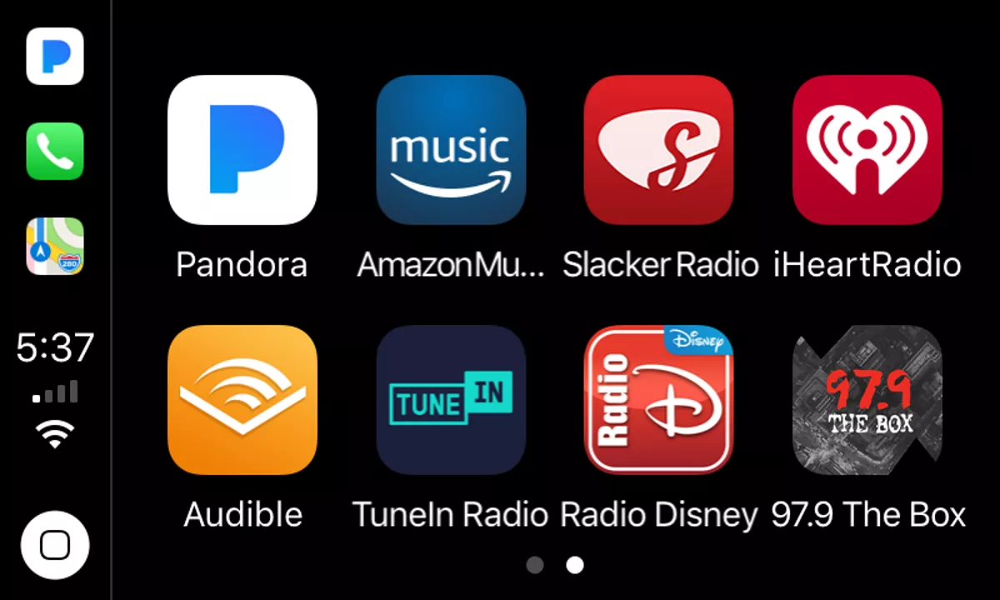
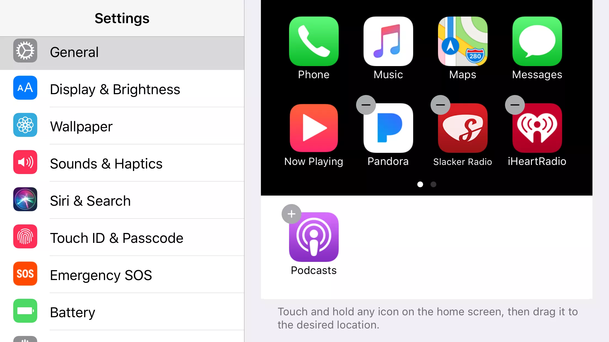
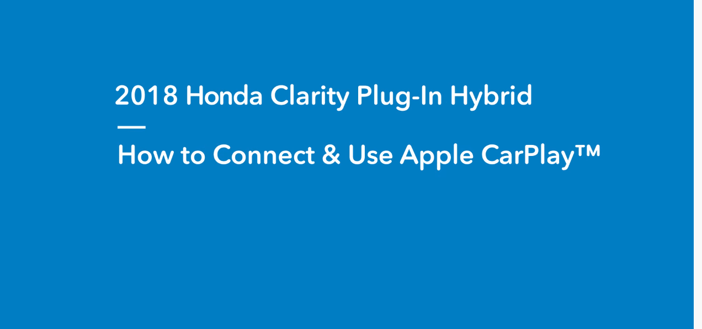
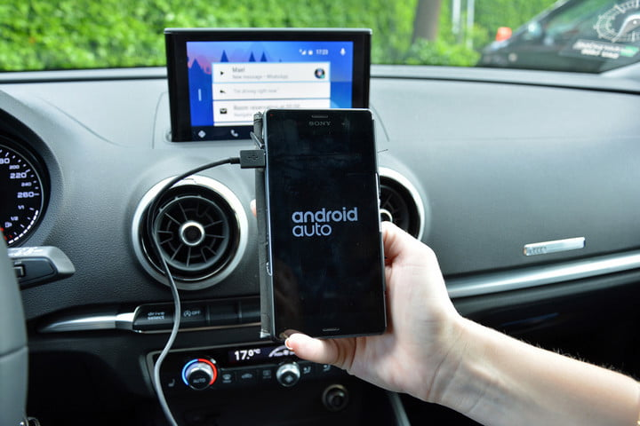

---
title:
- CSC 461 Project Proposal
author:
- Chao Jin
fontsize:
- 12pt
header-includes:
    - \usepackage{setspace}
    - \doublespacing
---

# Introduction and Research

## Background

Carplay technology is an Apple standard to allow users' IPhone to connect to their car stereo, which acts like a controller and demonstrated as a IOS operation like display. A Carplay stereo gives user access to IPhone's calling, music, mapping and message applications with a simple one-cord connection to user's IPhone using the phone's Lighting-to-USB cable or wireless.[1] This gives user a  full range of features that go-hand-in-hand with driving, or better yet, go hands free with driving.[2]

## History

Many automobile manufacturers have been building Carplay support into cars since 2015, but there's also a way to get Carplay in existing vehicles -- many aftermarket in-dash systems from Sony, Pioneer, Kenwood, and Alpine are compatible with Carplay and are readily available at reasonable prices. More than 400 vehicles manfacturers are coming out with Carplay support all the time.[3] As of late 2016, CarPlay is available in hundreds of cars, with manufacturers like Cadillac, Chevrolet, Fiat-Chrysler, Ford (all 2016 and 2017 models), GMC, Honda, Kia, Lincoln, Mercedes-Benz, Porsche, Volvo, Nissan, BMW, Hyundai, Porsche, Toyota, Volkswagen, and more offering CarPlay-equipped vehicles that are available now. Even semi trucks are gaining CarPlay support, with Volvo introducing its first CarPlay-equipped VNL series trucks, and Honda has introduced the first motorcycle with CarPlay support.[2]

Apple has created an official master list of all the CarPlay vehicles available in the United States and other countries. For those in search of a CarPlay-equipped vehicle, Apple's list is the best way to determine the options that are available. It is updated on a regular basis to add new models, but may not include new CarPlay vehicles as soon as they are announced.[3] For that reason, the CarPlay Timeline at the bottom of this roundup is also a good resource for finding news on CarPlay vehicles as soon as they're announced.

Apple's list includes over 400 new 2016, 2017, and 2018 models from more than 20 vehicle manufacturers, and additional automobile manufacturers are adding support on a regular basis.[3]

## User Case Analysis

### Customize the CarPlay Screen

Users can customize the CarPlay screen by moving popular third-party apps to the main screen or even hiding some of the default apps. It's actually quite easy, and you can do it anytime on your iPhone -- even when you don't have CarPlay active.

First, go into your iPhone's Settings app. This is the app with the gears turning.
Next, scroll down and tap General.
In the General settings, choose CarPlay. 
Users should see your car listed on this screen. Tap your car for settings specific to it.[3]
The car settings contain a virtual CarPlay screen. You can move apps around this screen just as you would on an iPhone: tap and hold to 'pick up' an app and keep your finger down on the display while moving it. To drop an app, just lift your finger.
Users can move an app from one page of apps to another page by dragging it to the very left or right edge of the virtual CarPlay's screen and then pausing while the screen flips to the new page.[5]
You can also hide an app by tapping the minus sign on the icon. This moves it to a menu of hidden apps just below the virtual CarPlay screen. You can add it back again by simply tapping it.

Carplay also allow users to add third-party Apps from App Store, such as WhatsApp, Spotify, BBC Sounds, Amazon Music, Google Play Music, iPlayer Radio, CBS Radio, Pandora and Waze. Users can customize the layout of the homescreen by themselves or tap the 'General' to automaticlly generate the screen.

### Voice control using Siri

Carplay has the ability to use Siri hands-free when driving, and can be done in one or two ways. One way is to use the Voice control button on the steering wheel of most, to hold the button until the users can hear the sound of Siri. Those using an aftermarket installation, or those that simply don’t want to hold a button to activate Siri, can use ‘Hey Siri’ on the iPhone to activate the virtual assistant, although results tend to be hit and miss if the environment is loud (car engine, music, etc). It’s also limited to newer iPhones (iPhone 6s and 6s Plus or newer).[4]

Siri voice control can be used for navigation, read/send text and browse for music. Siri can also help users make calls on the go without distracting users from the road. Simply say “Call someone/name” or “return my last call” and Siri will handle the rest. In fact, users can even get it to play back recent voicemails if users ask it to. Meanwhile, these options are also available via the CarPlay dashboard in the Phone app, but it’s not recommended that users interact with the touchscreen while driving.[4]

## Summary

Carplay is always said to be less disstracting for drivers than other system now on the current market. According to the user-side design and convenient functions search, Carplay suppose to be user-friendly and Apple relevant still tried to improve it in the latest IOS 13 update. The next section will search for reseach about Carplay disstracting tests, such as the time used for each function of Carplay during driving by different operations, and the comparsion between Carplay, Andriod Auto and other car-inner operation systems of some automobiile manufacturers.

#### Sources
https://www.vokal.io/blog/the-future-of-apple-carplay
https://www.intego.com/mac-security-blog/apples-carplay-is-a-useful-extension-to-your-iphone-when-driving/
https://www.macrumors.com/roundup/carplay/
https://www.macworld.co.uk/how-to/apple/use-carplay-3655285/
https://www.salon.com/2018/07/08/study-finds-apples-carplay-googles-android-less-distracting-but-still-not-safe_partner/

# Disscussion

## The AAA Foundation for Trafic Safety

The AAA Foundation for trafic safety is founded in 1997, which is volunteering not profitable.[1] It provides relevant research and forms public orgranization to support trafic safety and save lives.Many research and strategies are created and conducted to prevent traffic crashes and reduce injuries when they do occurs. The foundation was initially provided for traffic safety education and patrols, and it has took up the main seats of traffic satety at present.[3] The compasion bettween Apple Carplay and other native infotain
ment systems are mainly from recent research of the AAA Foundation of trafic safety.

## Comparsion with Android Auto Infotainment App

Like Apple CarPlay, Android Auto was developed to encourage motorists to keep their eyes on the road and their hands on the steering wheel. It works by Android operation system and has the Google Maps-powered navigation system, which provides step-by-step directions and automatically finds an alternate route if it detects heavy traffic.[5] In addition, Android Auto works with a variety of third-party apps in Google Play, all of which have been updated to integrate with Auto's specialized interface. These include messaging apps such as Kik, WhatsApp and Skype. There's also music apps including Pandora, Spotify and Google Play Music, natch. And there are audio apps ranging from Audible and NPR One to Overdrive and Stitcher.

In contrast, CarPlay is quite limited with regard to which third-party apps user could use because to add an app that can support IOS OS is more difficult than Andriod. However, App store is safer as compared to Google Play Store.[6] That is true because App Store takes much time in reviewing any application and then uploading on the main platform. App Store scrutiny criteria are based on a high-quality standard that is why it takes so much review time. Google Play Store has some low-quality apps, and its reviews and uploading process is not as complex as compared to App Store.

According to a recent Vulnerability Analysis of Android Infotainment Apps, a set of potential security threats are identified, and a static analyzer for the Android Auto infotainment system is presented.All the infotainment apps available in Google Play Store have been checked against that list of possible exposure scenarios. Results show that almost 80% of the apps are potentially vulnerable, out of which 25% poses security threats related to execution of JavaScript. CCS CONCEPTS • Security and privacy → Abstract Interpretation; Static Analysis;[3] In that case, those threat App connect to the Internet, hence gather information about the nearby area or the presence of parking slots. Such possibilities enhance the driving experience, but are also security concerns since apps can leak arbitrary data, including sensitive information on car, movements and drivers. Moreover, they can send dangerous commands: lock or unlock the car, activate its brakes, turn the engine on or off, accelerate, turn on the windshield wipers, and so on.[3]

## Comparison with native system

CarPlay is always marketed as being easier to use than native infotainment system by providing a unique interface for drivers to interact with it in user-friendly way. A research that involves an on-road evaulation of both Carplay and Android Auto in five different vehicles as participants performed a series of task types using different modes of interaction, which is aimed to test whether these hybrid is better than native system in different vihicles and how they achieve the traffic safety.

The vehicles tested are: 
• 2017 Honda Ridgeline RTL-E (HondaLink)
• 2017 Ford Mustang GT (SYNC 3)
• 2018 Chevrolet Silverado LT (MyLink)
• 2018 Kia Optima (UVO)
• 2018 Ram 1500 Laramie (Uconnect)

## Result

For the new study, test drivers performed an assigned set of tasks while driving five 2017 and 2018 model vehicles equipped with cameras along a two-mile stretch of a residential street at about 25 miles per hour. Using all three options — the in-vehicle controls, CarPlay and Android Auto — they played music, made calls, sent texts and programmed navigation.[2]

Most tasks were performed more easily and quickly with the smartphone-based systems. For example, sending a text was, on average, 5 seconds — or 24 percent — faster with CarPlay and Android Auto than with the built-in systems. Programming navigation was 15 seconds — or 31 percent — faster with the smartphone systems. However, that meant programming navigation still took an average of 33 seconds with the smartphone-based systems. In 33 seconds, the AAA foundation noted, a car travelling at 25 miles per hour covers the length of three football fields. 

Hence, Carplay is less distracting but improvement are necessary to gurantee the safety while driving. 

#### Sources
https://aaafoundation.org/wp-content/uploads/2018/06/AAA-Phase-6-CarPlay-Android-Auto-FINAL.pdf
https://www.salon.com/2018/07/08/study-finds-apples-carplay-googles-android-less-distracting-but-still-not-safe_partner/
https://aaafoundation.org/
https://www.researchgate.net/publication/325180444_Vulnerability_Analysis_of_Android_Auto_Infotainment_Apps
https://www.digitaltrends.com/cars/what-is-android-auto/
https://citrusbits.com/difference-app-store-vs-google-play-store/
https://developer.apple.com/carplay/
